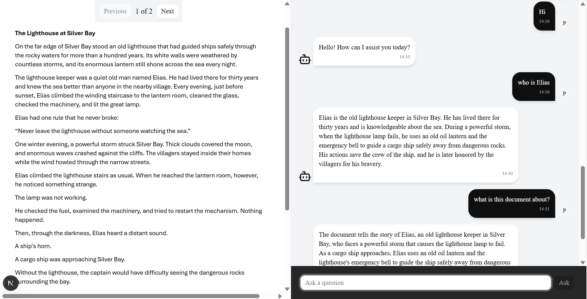

# DocuSense

A document-grounded chat application — upload a PDF, ask questions about it, and get answers that are strictly scoped to that document's content. Built to explore what a genuinely *safe* and *correct* RAG system looks like, not just a working demo.

## What it does

- Upload a PDF, get a split-pane view: the document on one side, a live chat on the other.
- Ask questions and get streamed, grounded answers — with citations traceable back to the document.
- Ask something the document doesn't cover, and the system says so clearly instead of guessing.
- Ask about the conversation itself ("what did I ask you before?") and it correctly answers from chat history instead of re-searching the document.
- Full auth, per-user document isolation, and persistent multi-turn memory.

## Why this exists

Most "chat with your PDF" tutorials wire up a single retrieval pass and call it done. This project asks a harder question: **what happens when retrieval is weak, when the model wants to answer from outside the document, or when a generated answer isn't actually grounded in what was retrieved?** Every one of those failure modes is handled explicitly here, not left to hope.



## Architecture

### The RAG pipeline — merged Corrective RAG + Self-RAG

The core retrieval pipeline combines two established RAG patterns into one LangGraph graph, deliberately scoped so it can never answer from outside the uploaded document:

- **Corrective RAG** — per-chunk LLM grading of retrieved content, with automatic query rewriting and re-retrieval if the initial results are too weak.
- **Self-RAG** — post-generation reflection: a groundedness check (is the answer actually supported by the retrieved context?) with an automatic revision loop, followed by a usefulness check (does the answer actually address the question?).

**Deliberately removed from both source patterns:** web search (Corrective RAG's typical fallback) and direct generation from the model's own parametric knowledge (Self-RAG's typical fallback). Both were replaced with a single explicit `no_answer_found` exit — the system says "I couldn't find this in the document" rather than ever reaching outside it. This was a conscious design decision, not an oversight: a document Q&A tool that quietly answers from general knowledge is misleading by default.

Retry loops are bounded and tracked with two independent counters — one for weak retrieval, one for answers judged not useful — so the system can self-correct without ever looping indefinitely.


### Why a fixed graph instead of a tool-calling agent

An alternative design would expose retrieval as a tool to a general-purpose agent and let it decide when/how to search. That was considered and deliberately not used here: this task has a well-defined verification pipeline (retrieve → grade → generate → check → check again), and a fixed graph gives bounded, predictable, fully testable behavior — every possible path through the system is enumerable. The trade-off is real: a tool-calling agent could adapt its strategy for genuinely novel query shapes (e.g. deliberately cross-referencing two different sections with separate searches) in a way this graph can't. For the realistic distribution of document Q&A queries, the fixed graph's predictability was judged more valuable than that flexibility.

### Streaming

Answers stream token-by-token from the `generate` node as they're produced. Because the pipeline can revise an answer after initial generation (if the groundedness check fails), the frontend streams the first draft live and then reconciles with an authoritative final event once the graph has fully finished — so a rare revision shows a clean correction rather than garbled, concatenated text. Paths that produce no LLM output at all (like `no_answer_found`, which returns a static message) are fake-streamed word-by-word so the UI never shows a jarring blank response.

### Per-document isolation

Each document's chunks live in their own Pinecone namespace (keyed by `doc_id`), so retrieval is structurally isolated per document — no cross-document leakage is possible, and no metadata filtering overhead is needed at query time. Authorization (which user can access which document) is enforced separately, at the API layer, before any retrieval call is made.

### Auth

Cookie-based JWT auth (`httpOnly`, so client-side JS can never read or tamper with the token). A Next.js rewrite proxy makes the frontend and backend appear same-origin to the browser, which lets cookies work correctly across both Server and Client Components without cross-domain cookie-scoping issues. Server Components read cookies directly and forward them manually on outbound backend requests (no browser involved in that hop); Client Components rely on the browser's normal cookie behavior through the proxy.

### Observability

Every graph execution is traced end-to-end via LangSmith — each node's inputs, outputs, and latency are individually inspectable, not just the final answer. This was genuinely useful during development for catching real bugs (e.g. discovering that a broad "summarize the document" query was being incorrectly filtered down to zero context by the sentence-level relevance filter, which led to the refine fallback described above) and for understanding the pipeline's actual latency breakdown per node.


### Data model

`User` → `Document` (one-to-many) → `Chat` (one-to-one) → `Message` (one-to-many). `Chat` is modeled as its own entity — distinct from `Document` — specifically so multiple chat sessions per document is a schema-level possibility later, even though the current version auto-creates one chat per upload.

## Tech stack

- **Backend:** FastAPI, SQLAlchemy (2.0 typed style), Alembic migrations, PostgreSQL (NeonDB)
- **AI/RAG:** LangGraph, LangChain, OpenAI, Pinecone (vector store), LangGraph's Postgres checkpointer (conversation memory)
- **Frontend:** Next.js (App Router), React Server Components, Tailwind, shadcn/ui
- **Storage:** Cloudinary (PDF file storage)
- **Auth:** JWT, httpOnly cookies

## Known limitations / future improvements

- The current graph issues one retrieval query per pass. A natural extension would let the system issue multiple sub-queries for genuinely multi-angle questions (e.g. "compare how the introduction and conclusion describe X").
- Chat history is stored twice — once in the application's own `Message` table (source of truth for the frontend) and once implicitly via LangGraph's checkpointer (used for the graph's own short-term reasoning). This is intentional, not redundant, but worth noting.
- No rate limiting or usage quotas yet.

## Setup

```bash
# Backend
cd Backend
uv sync
uv run alembic upgrade head
uv run fastapi dev main.py

# Frontend
cd frontend
npm install
npm run dev
```

### Environment variables (Backend `.env`)

| Variable | Purpose |
|---|---|
| `OPENAI_API_KEY` | Powers every LLM call in the pipeline — routing, grading, refinement, generation, groundedness/usefulness checks |
| `DATABASE_URL` | PostgreSQL connection string (NeonDB) — used by both SQLAlchemy and LangGraph's Postgres checkpointer for conversation memory |
| `PINECONE_API_KEY` | Vector store for document chunk embeddings and retrieval |
| `SECRET_KEY` | Signs and verifies JWT access tokens for auth |
| `CLOUDINARY_CLOUD_NAME` | Cloudinary account identifier, for storing uploaded PDFs |
| `CLOUDINARY_API_KEY` | Cloudinary API authentication |
| `CLOUDINARY_API_SECRET` | Cloudinary API authentication (kept server-side only, never exposed to the frontend) |
| `LANGCHAIN_TRACING_V2` | Enables LangSmith tracing — set to `true` to get full run traces of every graph execution (used to generate the architecture trace shown above) |
| `LANGCHAIN_ENDPOINT` | LangSmith's API endpoint |
| `LANGCHAIN_API_KEY` | LangSmith authentication |
| `LANGCHAIN_PROJECT` | Groups traces under a named project in the LangSmith dashboard |

**Note:** `TAVILY_API_KEY` was used during early development (Corrective RAG's original web-search fallback) but is no longer needed — web search was deliberately removed from the final pipeline (see *Architecture* above), so this variable can be omitted.