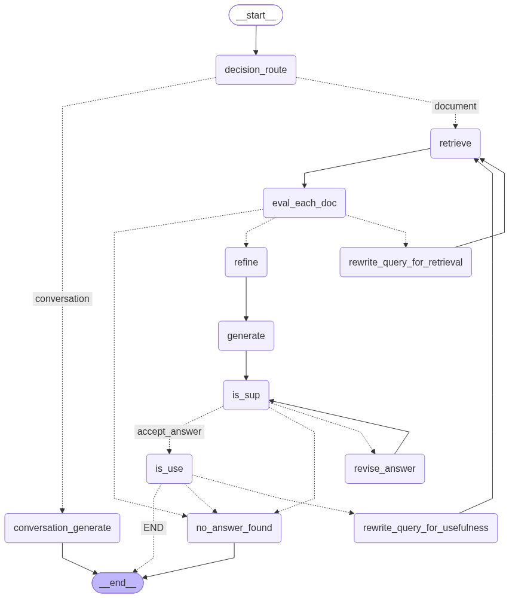
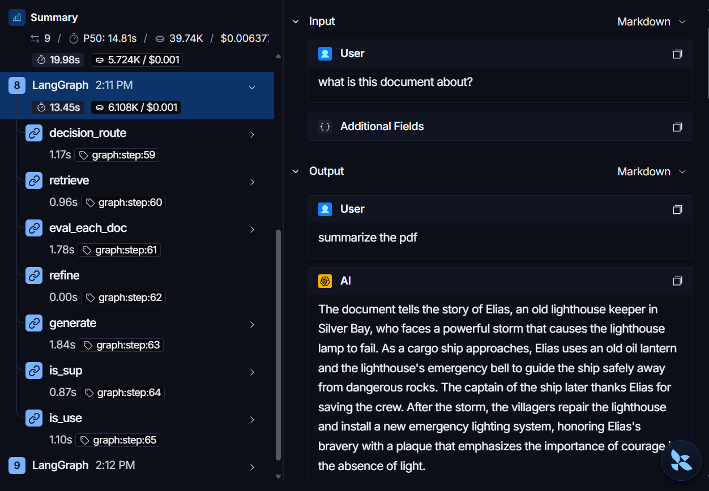

# DocuSense

Chat with a PDF — but every answer is verified against the document before it's shown, and if the document doesn't cover the question, the system says so instead of guessing.

**[Live demo](#)** · [Architecture](#architecture)

---

## The problem this solves

Most "chat with your PDF" projects wire up a single retrieval pass and call it done — the model can still answer from its own training data, or fall back to a live web search when retrieval comes up short. Either way, the user has no way to know whether an answer actually came from their document.

**This project is built around one constraint: every answer must come only from the uploaded document, or the system explicitly says it doesn't know.** Every retry path, every fallback, and every design decision below exists to enforce that, not just to make a chatbot work.

## Features

- Upload a PDF, get a split-pane view — document on one side, live chat on the other
- Streamed answers, verified for groundedness and usefulness before being shown
- Explicit "not found" responses when a question isn't covered — no hallucinated fallback
- Conversation-aware follow-ups ("what did I ask you before?") answered from chat history, not re-searched against the document
- JWT authentication with per-user authorization and persistent multi-turn memory across sessions

## Architecture

### Pipeline: a modified hybrid of Corrective RAG and Self-RAG

```
retrieve → grade chunks → [weak? rewrite query, retry] → refine → generate
    → check groundedness → [ungrounded? revise, retry]
    → check usefulness → [not useful? rewrite query, retry]
    → return answer
```

| From | Kept | Removed / changed |
|---|---|---|
| **Corrective RAG** | Per-chunk relevance grading; query rewriting on weak retrieval | Web search fallback → removed entirely; three-tier verdict (correct/ambiguous/incorrect) → collapsed to a simpler pass/fail threshold after testing showed the middle tier added retries without adding value |
| **Self-RAG** | Groundedness check + revision loop; usefulness check + retry loop | Direct generation from the model's own knowledge (when retrieval was skipped) → removed entirely |

**Why both fallbacks were removed:** this is the most deliberate decision in the project. Corrective RAG's web-search fallback and Self-RAG's direct-generation fallback both exist to let the system answer even when the document doesn't cover something. For a document Q&A tool, that's exactly the wrong behavior. Both were replaced with a single explicit exit — `no_answer_found` — which tells the user plainly that the document doesn't cover their question.


*Auto-generated from the compiled LangGraph, via `draw_mermaid_png()`.*

### From filtered refinement to straight reformatting

An earlier version of this step used a second LLM call to judge each decomposed sentence individually — keeping only sentences directly relevant to the question before passing context to generation. In testing, this backfired for broad questions: for a request like "summarize the document," no single sentence can "directly answer" a summarization request in isolation, so the filter was rejecting every sentence and leaving generation with empty context.

Rather than patch around that with a fallback (generate a workaround for a workaround), the filtering step was removed. `refine` now decomposes graded, relevant chunks into individual sentences and rejoins them into a clean context string — no additional LLM call, no risk of over-filtering, and one fewer place where the pipeline could silently discard content it shouldn't have. The sentence decomposition still normalizes formatting from the raw PDF extraction, but the relevance judgment now rests entirely on the earlier chunk-level grading step, not a second, finer-grained pass.

### How the pipeline decides

| Decision point | Condition | Outcome |
|---|---|---|
| Route (document vs. conversation) | Is the question explicitly about prior chat turns? | If yes → answered from conversation history. Everything else — including anything ambiguous — defaults to the document pipeline, since it already handles "not found" gracefully and the conversation path does not. |
| Retrieval grading | Do *all* retrieved chunks score below the relevance threshold? | If yes → query is rewritten and retrieval retries (bounded); otherwise the graded-good chunks proceed to refinement. |
| Refinement | Chunks that passed grading are decomposed into sentences and rejoined into context | No further filtering happens here — relevance judgment rests entirely on the earlier chunk-level grading step, not a second finer-grained pass (see below for why). |
| Groundedness | Is the generated answer fully supported by the retrieved context? | If not, and retries remain → answer is revised (forced into a strict quote-only format) and re-checked. If retries are exhausted and the answer is completely unsupported → routed to `no_answer_found` rather than shown. A partially-supported answer after exhausted retries is still shown, since it's judged more useful than a hard refusal for a minor phrasing issue. |
| Usefulness | Does the (grounded) answer actually address the question asked? | If not, and retries remain → query is rewritten and retrieval retries. If retries are exhausted → `no_answer_found`. |
| Retry budgets | Two independent counters — one for weak retrieval, one for "not useful" answers | Each is bounded separately, so the system can self-correct without either failure mode being able to loop indefinitely. |

### Why a fixed graph instead of a tool-calling agent

An alternative design would expose retrieval as a tool to a general-purpose agent and let the model decide when and how to search. This was considered and deliberately not used: this task has a well-defined verification pipeline, and a fixed graph gives bounded, enumerable, fully testable behavior. The trade-off is real — an agent could adapt its strategy for genuinely novel query shapes (e.g. issuing separate searches to cross-reference two sections) in a way this graph can't. For the realistic distribution of document Q&A queries, predictability was judged more valuable than that flexibility.

### Streaming

Answers stream token-by-token as newline-delimited JSON (NDJSON) as they're generated. Because the pipeline can revise an answer after initial generation, the frontend streams the first draft live and reconciles with an authoritative final event once the graph has fully finished — a rare revision shows as a clean correction, not concatenated/garbled text. Paths with no LLM output (`no_answer_found`, which returns a static message) are fake-streamed word-by-word so the UI never shows a blank response.

## Security & isolation

- **Auth:** JWT in an `httpOnly` cookie, inaccessible to client-side JavaScript — so if an XSS vulnerability were ever present elsewhere in the app, the token itself couldn't be read or exfiltrated through it. This doesn't prevent XSS from occurring; it limits what a successful one could steal.
- **Per-user authorization:** every document/chat route checks document ownership before doing any work — a request for a document that doesn't exist returns 404; a request for a document that exists but belongs to another user returns 403.
- **Per-document vector isolation:** each document's chunks live in their own Pinecone namespace, keyed by `doc_id`. Retrieval is structurally scoped to one document — there's no cross-document leakage to filter out, because the search space never contains another document's data in the first place.
- **Same-origin cookie handling:** a Next.js rewrite proxy makes frontend and backend appear same-origin to the browser, so cookies work correctly across both Server and Client Components without cross-domain scoping issues.

## Request lifecycle — asking a question

1. User submits a question in the chat panel (Client Component).
2. Request hits `PUT /api/chats/{doc_id}/stream`, authenticated via the forwarded cookie.
3. Backend verifies the document exists and the requesting user owns it (404 / 403 as above).
4. The question enters the LangGraph pipeline: retrieve → grade → refine → generate, streaming tokens back as NDJSON as soon as the first draft is produced.
5. After generation, the pipeline runs its groundedness and usefulness checks in sequence; if either fails, it revises or retries — the frontend reconciles the displayed answer to match once the graph fully completes.
6. The final human/AI message pair is persisted to Postgres (`Message` table); the frontend receives a `final` event confirming the saved, authoritative answer.

## Project structure

```
Backend/
  app/
    auth/            JWT auth, current-user dependency
    config/           settings, database, vectorstore config
    models/            SQLAlchemy models
    RAG/              LangGraph pipeline, ingestion
    routers/         FastAPI routes (users, documents, chats)
    schemas.py         Pydantic request/response models
  alembic/            migrations

frontend/
  app/                 Next.js App Router pages
  components/       Chat, PdfView, Header, shadcn/ui primitives
  lib/                 shared config (BACKEND_URL, etc.)
  proxy.ts            route protection (Next.js 16 middleware)
```

## Observability

Every graph execution is traced end-to-end via LangSmith — each node's inputs, outputs, and latency are individually inspectable. This was genuinely useful during development: it's how the "summarize the document" refinement bug described above was actually caught and diagnosed.


*One real traced run, shown for illustration — not a formal benchmark. Latency varies with document size, query complexity, and how many retry/revision loops a given question triggers.*

## Data model

`User` → `Document` (one-to-many) → `Chat` (one-to-one) → `Message` (one-to-many). `Chat` is modeled as its own entity — distinct from `Document` — specifically so multiple chat sessions per document is a schema-level possibility later, even though the current version auto-creates one chat per upload.

## Tech stack

**Backend:** FastAPI · SQLAlchemy 2.0 · Alembic · PostgreSQL (NeonDB)
**AI/RAG:** LangGraph · LangChain · OpenAI · Pinecone · LangGraph Postgres checkpointer
**Frontend:** Next.js (App Router) · React Server Components · Tailwind · shadcn/ui
**Storage:** Cloudinary
**Auth:** JWT, httpOnly cookies

## Known limitations / future improvements

- The graph issues one retrieval query per pass; a natural extension would let it issue multiple sub-queries for genuinely multi-angle questions (e.g. comparing two sections of a document).
- No inline source citations in the chat UI yet — answers are grounded and verified internally, but the specific supporting passage isn't currently surfaced to the user.
- Chat history is stored twice: once in the app's own `Message` table (source of truth for the UI) and once via LangGraph's checkpointer (used for the graph's own short-term reasoning). Intentional, not redundant, but worth knowing.
- No rate limiting or usage quotas yet.

## Setup

```bash
# Backend
cd Backend
uv sync
uv run alembic upgrade head
uv run fastapi dev main.py

# Frontend
cd frontend
npm install
npm run dev
```

### Environment variables (Backend `.env`)

| Variable | Purpose |
|---|---|
| `OPENAI_API_KEY` | Powers every LLM call — routing, grading, refinement, generation, groundedness/usefulness checks |
| `DATABASE_URL` | PostgreSQL connection string (NeonDB) — used by SQLAlchemy and LangGraph's checkpointer |
| `PINECONE_API_KEY` | Vector store for document chunk embeddings and retrieval |
| `SECRET_KEY` | Signs and verifies JWT access tokens |
| `CLOUDINARY_CLOUD_NAME` / `CLOUDINARY_API_KEY` / `CLOUDINARY_API_SECRET` | PDF file storage (server-side only, never exposed to the frontend) |
| `LANGCHAIN_TRACING_V2` / `LANGCHAIN_ENDPOINT` / `LANGCHAIN_API_KEY` / `LANGCHAIN_PROJECT` | LangSmith tracing, used to generate the trace shown above |

**Note:** an earlier version of this pipeline used Tavily for web search (the original Corrective RAG fallback). It was removed for the reasons described above; a `TAVILY_API_KEY` variable is not needed.